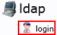
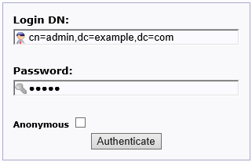
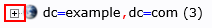
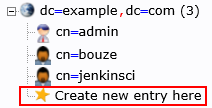
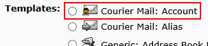

Registering Users
============

When using the incorporated user administration function (user service),
you can register users to the LDAP server as described below.

1.  Access the user service URL (e.g., http://user.pocci.test/) with a browser.
2.  Click **login** on the left side of the screen to display the login screen.

    

3.  Enter the information in **Login DN:** (default: `cn=admin,dc=example,dc=com`) and
    **Password:** (default: `admin`),  and then click the **Authenticate** button
    to log in with administrator permissions.

    

4.  Click the **+** button on the left of **dc=xxx,dc=xxx*** (`dc=example,dc=com` when default setting)
    on the left side of the screen.

    

5.  Click **Create new entry here**.

    

6.  Select `Courier Mail: Account` which is the first template of **Templates:**.

    

7.  Enter the user information as shown below and then click **Create Object**.
    *   **Given Name :**    Given name
    *   **Last name :**     Last name
    *   **Common Name :**   User ID
        * This will be entered automatically, but change it to the user ID.
    *   **User ID :**       User ID (Same as for Common Name)
    *   **Email :**         E-mail address
    *   **Password :**      Initial password

8.  The confirmation screen appears. Click **Commit**.
